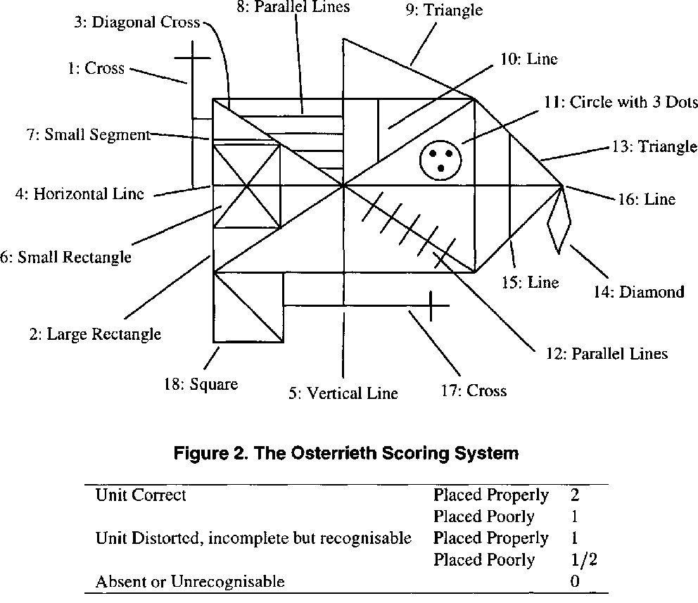

# Automated Scoring of the Rey-Osterrieth Complex Figure

Pytorch implementation of CNNs to automate the scoring of Rey-Osterrieth Complex Figure [1]. The rating of the figure is
subdivided into ratings of 18 individual subelements and is illustrated in the following figure:

  

## Overview

General high-level workflow to train and evaluate models:

1. Prepare your data: images are preprocessed, augmented and stored as .npy files. This is done via
   the `prepare_data.py` script.
2. Training of modles
    1. For the scoring regression model, use the script `train_regressor.py` and set appropriate flags.
    2. For the binary element classifiers, use the script `train_classifier.py` and set appropriate flags
3. To evaluate the models, use the script `eval_classifiers.py` or `eval_regressor.py`.
    1. For the regressor, this will compute the overall score MSE, the binned MSE, the item MSE and a csv file
       containing the predicted score on each sample in the test set.
    2. For the binary classifiers, this will compute precision / recall / geometric mean scores and a csv file
       containing the classification outcome for each sample in the test set

### scripts which are still under construction:

* `compute_confusion_matrix.py` (todo: turn location of predictions csv's into flags; currently hardcoded)
* `houghlines_preprocessing.py` (experimental: figure out how to best do preprocessing for photo data)

## Preparing Data

Preparing data is done via the `prepare_data.py` script. Make sure that your data is organized in the way shown below.
The script has to be used as follows:

```
python prepare_data.py --data-root /path/to/data/root --dataset dataset-name --augment --image-size height width
```

The flag `--data-root` specifices where the data is located. It is also in the directory where a new
folder `serialized-data` will be created and which will contain the preprocessed datasets.

The flag `--dataset` specificies which data is processed; this must be one of

* `scans-2018`: contains all data from 2018
* `scans-2018-2021`: contains all scanned images from 2018 and 2021
* `data-2018-2021`: contains all data, including photos (not that the preprocessing pipeline is not yet optimized for
  photo data)

If the flag `--augment` is set, then the dataset will be augmented (see `src/data/augmentation.py` for data augmentation
details). If data augmentation is enabled, 9 augmented images will be randomly generated and stored along with the
original image. As data augmentation slightly changes the distribution of images, test data will also be altered via
the `simulate_augment_image` function in `src/data/augmentation.py`.

The flag `--image-size` determines the size of the images. Standard is to use `116 150`.

### Data root structure

The script `prepare_data.py` expects your data to be organized in the following way:

    ├──data_root
        ├── DBdumps
        ├── ProlificExport
        ├── ReyFigures
        │ ├── data2018
        │ │ ├── newupload
        │ │ ├── newupload_15_11_2018
        │ │ ├── newupload_9_11_2018
        │ │ ├── uploadFinal
        │ │ └── uploadFinalREF
        │ └── data2021
        │     ├── KISPI
        │     ├── Tino_cropped
        │     ├── Typeform
        │     ├── USZ_fotos
        │     └── USZ_scans
        └── UserRatingData

### Todos

* integrate this with the newly generated (simulated) images; i.e. account for another directory in the dir structure.

## Training models

### Regression model

The regression models predict the score for each of the 18 elements of the Rey Figure. Each element is assigned on of
the score {0, 0.5, 1, 2}. The overall score is the sum over all element scores and ranges from 0 to 36.

Training the regression model is done via the script `train_regeressor.py` which is used in the following way:

```
python train_regeressor.py  --data-root </path/to/serialized/dataset/dir> \
                            --results-dir </dir/where/results/are/stored> \
                            --val-fraction <number between 0 and 1> \
                            --eval-test \  # if set, the at the end of training, this will evaluate the trained model on the test set
                            --arch rey-regressor  \  # only choice is currently rey-regressor (default)
                            --image-size 116 150 \  # must be the same as serialized images in data-root
                            --norm-layer <batch or group normalization> \  # type of normalization applied to activations
                            --epochs <number of training epochs> \
                            --batch-size <...> \
                            --lr <learning rate> \
                            --beta <weight of the score mse in the total loss> \
                            --gamma <learning rate decay rate> \
                            --wd <weight decay> \
                            --dropout 0.3 0.5 \  # the first is applied to conv layers, the second to dense layers
                            --bn-momentum <momentum for batch normalization> \  # only applied for batch_norm
                            --resume \  # resume previously halted training
                            --seed 7 \  # random seed for reproducibility
                            --score-type sum \  # better to use sum so that sum(elements) = total score; only matters if beta > 0.  
```

Trained on the `scans-2018-augmented` dataset, the following configuration currently leads to the best performance:

|val-fraction | image-size | norm-layer | epochs  |  batch-size  | lr  |  beta | gamma | wd  | dropout  | bn-momentum | score-type |
|---|---|---|---|---|---|---|---|---|---|---|---|
| 0.2  | 116 150  | batch_norm  |  500 | 64  | 1e-4  | 0.0  |  1.0 | 0.0  | 0.3 0.5  | 0.01  | sum  |

Main Performance measures:

* items MSE: 0.1095076590988027
* score MSE: 3.696144732906883
* bin-v1 MSE: 0.8609583660644148
* bin-v2 MSE: 0.9473684210526315

Performance (MSE) on specific items:

* item 1         : 0.08978799092545028
* item 2         : 0.14354320502631462
* item 3         : 0.12968864525756538
* item 4         : 0.17234492539691174
* item 5         : 0.14199563396629214
* item 6         : 0.1295628616981198
* item 7         : 0.09112404177026659
* item 8         : 0.09577011195008388
* item 9         : 0.09124661936495206
* item 10        : 0.051479329613111385
* item 11        : 0.1005950428313251
* item 12        : 0.10433728534435813
* item 13        : 0.137197291574883
* item 14        : 0.11109849101804065
* item 15        : 0.09201111641023571
* item 16        : 0.12213989183872058
* item 17        : 0.08666661597957598
* item 18        : 0.08054876381224177

Viewed as a multilabel classifier detecting whether or not a given element is present (i.e. element k has label 0 if
score < 0.25 and label 1 otherwise), we have the following metrics:

metric       |    item 1 |    item 2 |   item 3 |    item 4 |    item 5 |   item 6 |   item 7 |   item 8 |   item 9 |   item 10 |   item 11 |   item 12 |   item 13 |   item 14 |   item 15 |   item 16 |   item 17 |   item 18
|---|---|---|---|---|---|---|---|---|---|---|---|---|---|---|---|---|---|---|
sensitivity |    0.9913 |    0.9964 |   0.9866 |    0.9952 |    0.9827 |   0.9682 |   0.9539 |   0.9557 |   0.9770 |    0.9745 |    0.9991 |    0.9615 |    0.9871 |    0.9936 |    0.9870 |    0.9890 |    0.9922 |    0.9910
specificity |    0.7923 |    0.3038 |   0.7789 |    0.4959 |    0.6410 |   0.8152 |   0.9588 |   0.8100 |   0.8924 |    0.9751 |    0.6065 |    0.9204 |    0.5323 |    0.6821 |    0.8946 |    0.7722 |    0.7449 |    0.6241
g-mean      |    0.8862 |    0.5502 |   0.8766 |    0.7025 |    0.7937 |   0.8884 |   0.9564 |   0.8799 |   0.9337 |    0.9748 |    0.7784 |    0.9407 |    0.7248 |    0.8232 |    0.9397 |    0.8739 |    0.8597 |    0.7864

### Classification models

For each of the 18 elements, a binary classifier is trained to predict whether or not the element of interest is present
in the figure. The idea is that this set of classifiers assists the scoring network to make better predictions.

Training a classification model is done via the script `train_classifier.py` which is used in the following way:

```
python train_classifier.py  --data-root </path/to/serialized/dataset/dir> \
                            --results-dir </dir/where/results/are/stored> \
                            --val-fraction <number between 0 and 1> \
                            --eval-test \  # if set, the at the end of training, this will evaluate the trained model on the test set
                            --item <item num>  \  # 1 ... 18
                            --image-size 116 150 \  # must be the same as serialized images in data-root
                            --norm-layer <batch or group normalization> \  # type of normalization applied to activations
                            --epochs <number of training epochs> \
                            --batch-size <...> \
                            --lr <learning rate> \
                            --gamma <learning rate decay rate> \
                            --wd <weight decay> \
                            --dropout 0.3 0.5 \  # the first is applied to conv layers, the second to dense layers
                            --bn-momentum <momentum for batch normalization> \  # only applied for batch_norm
                            --weighted-sampling 1 \  # if set to 1 weighted samplign is applied (recommended as data is imbalanced)
                            --resume \  # resume previously halted training
                            --seed 7 \  # random seed for reproducibility  
```

Hyperparams:

|val-fraction | image-size | norm-layer | epochs  |  batch-size  | lr   | gamma | wd  | dropout  | bn-momentum |
|---|---|---|---|---|---|---|---|---|---|
| 0.2  | 116 150  | batch_norm  |  100 | 64  | 1e-4   |  1.0 | 0.0  | 0.3 0.5  | 0.01  |

Results:

metric       |   item 1 |   item 2 |   item 3 |   item 4 |   item 5 |   item 6 |   item 7 |   item 8 |   item 9 |   item 10 |   item 11 |   item 12 |   item 13 |   item 14 |   item 15 |   item 16 |   item 17 |   item 18
|---|---|---|---|---|---|---|---|---|---|---|---|---|---|---|---|---|---|---|
sensitivity |    0.983 |    0.975 |    0.971 |    0.980 |    0.973 |    0.972 |    0.940 |    0.950 |    0.964 |     0.963 |     0.988 |     0.979 |     0.979 |     0.987 |     0.979 |     0.969 |     0.990 |     0.951
specificity |    0.923 |    0.424 |    0.832 |    0.566 |    0.628 |    0.848 |    0.967 |    0.814 |    0.906 |     0.965 |     0.987 |     0.968 |     0.570 |     0.913 |     0.915 |     0.781 |     0.807 |     0.843
g-mean      |    0.952 |    0.643 |    0.899 |    0.745 |    0.782 |    0.908 |    0.954 |    0.879 |    0.934 |     0.964 |     0.988 |     0.973 |     0.747 |     0.950 |     0.946 |     0.870 |     0.894 |     0.895

### Todos

* combine classifiers and regression model

## Evaluating models

This is done via the scripts `eval_classifiers.py` and `eval_regressor.py`. For the former, make sure that the
flag `results-dir` points to a directory which contains results-dirs of all classifiers (i.e. `aux_classifier_item_k`
for k = 1 to 18).

## References

[1] https://en.wikipedia.org/wiki/Rey–Osterrieth_complex_figure
